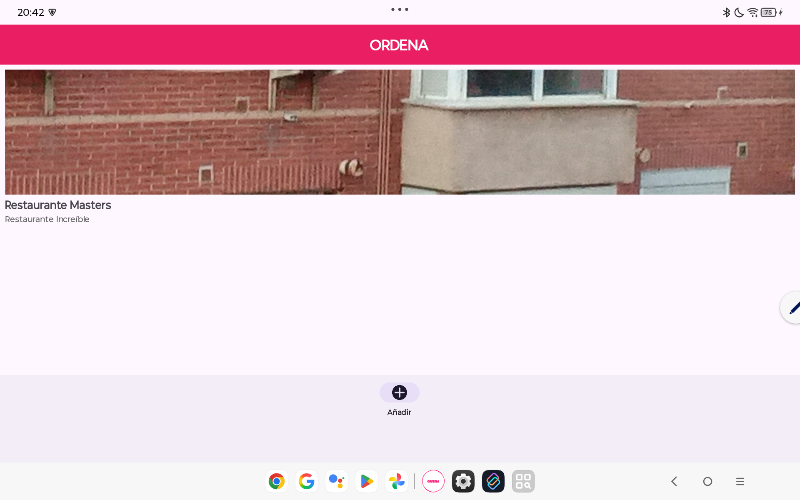
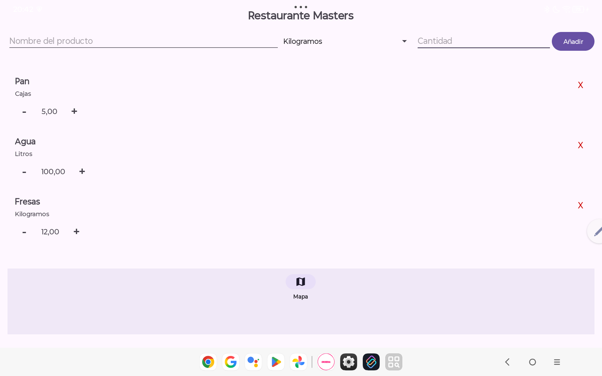

# Ordena 🍽️

**Aplicación Android para la gestión de restaurantes y su inventario de productos.** Ordena permite registrar restaurantes con foto y dirección, controlar el stock de productos por establecimiento, visualizar ubicaciones en Google Maps y recibir alertas automáticas cuando el inventario baja de nivel crítico.

***

## Descripción

Ordena surge como solución práctica para quienes necesitan llevar un control de inventario por establecimiento directamente desde su dispositivo Android. La app organiza los datos en dos niveles: una lista principal de restaurantes y, dentro de cada uno, un inventario de productos con unidades y cantidades. Toda la información se almacena localmente mediante SQLite, sin necesidad de conexión a internet.

***

## Capturas de pantalla

| Lista de restaurantes | Inventario de productos |
|:--------------------:|:----------------------:|
|  |  |

***

## Características principales

- 🏪 **Gestión de restaurantes**: añade, consulta y elimina restaurantes con nombre, descripción, foto personalizada y dirección física.
- 📦 **Inventario por restaurante**: registra los productos de cada establecimiento indicando nombre, unidad de medida y cantidad en stock.
- ➕➖ **Control de stock en tiempo real**: incrementa o decrementa la cantidad de cada producto directamente desde la lista con botones +/−.
- 🗺️ **Integración con Google Maps**: visualiza todos los restaurantes sobre el mapa o navega a la ubicación de un restaurante concreto desde la pantalla de su inventario.
- 🔔 **Alertas de stock bajo**: cuando la cantidad de un producto cae a X unidades o menos, la app lanza automáticamente una notificación push al dispositivo.
- ↩️ **Deshacer eliminación**: al borrar un restaurante deslizando (swipe), aparece un Snackbar con opción de deshacer la acción antes de que sea permanente.
- 📸 **Foto del restaurante**: al añadir un restaurante se puede adjuntar una foto desde la galería o la cámara del dispositivo.

***

## Pantallas y flujo de navegación

```
MainActivity (Lista de restaurantes)
    │
    ├── [+ Añadir]  ──►  AddRestaurantActivity (nombre, descripción, foto, dirección)
    │
    ├── [Tap en restaurante]  ──►  ProductActivity (inventario del restaurante)
    │                                    │
    │                                    └── [Icono mapa]  ──►  RestaurantMapActivity
    │                                                            (ubica ese restaurante)
    │
    └── [Mapa]  ──►  RestaurantMapActivity (todos los restaurantes en el mapa)
```

La navegación entre pantallas se apoya en `BottomNavigationView` (Material Design) y en el paso de datos entre Activities mediante `Intent` extras, usando `Parcelable` para el objeto `Restaurant`.

***

## Modelo de datos

La base de datos SQLite se gestiona a través de `RestaurantDbHelper` (versión 3), que crea y migra las tablas de forma incremental sin pérdida de datos.

### Tabla `restaurants`

| Columna | Tipo | Descripción |
|---------|------|-------------|
| `_id` | INTEGER PK AUTOINCREMENT | Identificador único |
| `name` | TEXT NOT NULL | Nombre del restaurante |
| `description` | TEXT NOT NULL | Descripción |
| `image_res_id` | INTEGER | Recurso de imagen por defecto |
| `image_path` | TEXT | Ruta a foto personalizada (nullable) |
| `address` | TEXT | Dirección física (nullable) |

### Tabla `products`

| Columna | Tipo | Descripción |
|---------|------|-------------|
| `_id` | INTEGER PK AUTOINCREMENT | Identificador único |
| `name` | TEXT NOT NULL | Nombre del producto |
| `unit` | TEXT NOT NULL | Unidad de medida (kg, L, uds…) |
| `quantity` | REAL NOT NULL | Cantidad en stock |
| `restaurant_id` | INTEGER NOT NULL (FK) | Referencia al restaurante |

La tabla `products` tiene una clave foránea que referencia a `restaurants`, garantizando la integridad referencial entre ambas tablas.

***

## Estructura del proyecto

| Clase | Tipo | Responsabilidad |
|-------|------|-----------------|
| `MainActivity` | Activity | Lista principal de restaurantes, swipe-to-delete con undo, navegación al mapa global |
| `ProductActivity` | Activity | Inventario de un restaurante, CRUD de productos, alertas de stock bajo, navegación al mapa individual |
| `RestaurantMapActivity` | Activity | Muestra uno o varios restaurantes en Google Maps mediante un Intent geo URI |
| `MapPickerActivity` | Activity | Permite al usuario seleccionar una ubicación en el mapa para asociarla a un restaurante |
| `Restaurant` | Data class | Modelo de dominio del restaurante, implementa `Parcelable` para su paso entre Activities |
| `Product` | Data class | Modelo de dominio del producto con referencia al restaurante padre |
| `RestaurantAdapter` | RecyclerView.Adapter | Renderiza la lista de restaurantes con imagen, nombre y descripción |
| `ProductAdapter` | RecyclerView.Adapter | Renderiza el inventario con controles de cantidad +/− y botón de eliminar |
| `RestaurantDbHelper` | SQLiteOpenHelper | Creación, migración y acceso a la base de datos SQLite |
| `RestaurantContract` | Object | Constantes de la tabla `restaurants` (nombres de columnas y tabla) |
| `ProductContract` | Object | Constantes de la tabla `products` (nombres de columnas y tabla) |

***

## Tecnologías utilizadas

- **Kotlin** — lenguaje principal de toda la aplicación.
- **SQLite + SQLiteOpenHelper** — persistencia local con migraciones incrementales entre versiones de base de datos.
- **RecyclerView + ItemTouchHelper** — listas eficientes con soporte de gestos (swipe-to-delete).
- **Material Design Components** — `BottomNavigationView`, `Snackbar` y estilos del sistema de diseño de Google.
- **Android Notifications API** — canal de notificaciones para alertas de stock bajo, compatible con Android 8.0+ (canales) y Android 13+ (permisos en tiempo de ejecución).
- **Google Maps (Intent geo URI)** — visualización de ubicaciones sin necesidad de SDK de Maps; usa la app de mapas instalada en el dispositivo.
- **Parcelable** — serialización eficiente de objetos `Restaurant` para su paso entre Activities.
- **Android Studio** — entorno de desarrollo oficial para Android.

***

## Permisos requeridos

| Permiso | Motivo |
|---------|--------|
| `POST_NOTIFICATIONS` | Enviar alertas de stock bajo (Android 13+) |
| `CAMERA` *(si se usa la cámara)* | Capturar fotos de restaurantes |
| `READ_EXTERNAL_STORAGE` / `READ_MEDIA_IMAGES` | Seleccionar fotos de la galería |

***

## Requisitos

- Android 6.0 (API 23) o superior
- Google Maps instalado en el dispositivo (para la funcionalidad de mapa)
- Android Studio Hedgehog o posterior (para compilar desde código fuente)

***

## Instalación

1. Clona el repositorio:
   ```bash
   git clone https://github.com/Llarry793/Ordena.git
   ```
2. Abre el proyecto en Android Studio.
3. Sincroniza las dependencias de Gradle.
4. Ejecuta la app en un emulador o dispositivo físico con Android 6.0+.

***

## Posibles mejoras futuras

- Migrar la capa de datos a **Room** para aprovechar consultas tipadas, LiveData y migraciones declarativas.
- Implementar **búsqueda y filtrado** de restaurantes por nombre o dirección.
- Añadir **exportación de inventario** a CSV o PDF.
- Integrar el **SDK de Google Maps** para un selector de ubicación visual dentro de la propia app.
- Incorporar **sincronización en la nube** (Firebase Firestore) para compartir datos entre dispositivos.
- Añadir **tests unitarios e instrumentados** para la lógica de base de datos y la UI.

***

## Autores

Desarrollado por **Miguel** y **Óscar** (UV) como proyecto Android con foco en persistencia SQLite, gestión de intents entre Activities y uso de APIs nativas del sistema (mapas, cámara, notificaciones).
